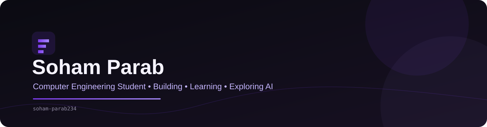

  

  

  
  &nbsp;
  
  &nbsp;
  
  &nbsp;
  

  <!-- Future:
  <a href="YOUR_LEETCODE_URL" target="_blank">...</a>
  <a href="YOUR_RESUME_URL" target="_blank">...</a>
  <a href="YOUR_PORTFOLIO_URL" target="_blank">...</a>
  -->

  

---

<h2 align="center">🟣 About Me</h2>

  

  👋 Hey! I'm <b>Soham Parab</b>, a <b>Computer Engineering student</b> who enjoys learning how technology works and turning ideas into practical projects.
    
  I'm currently building my foundation in programming, software development, data structures, AI and machine learning while working on projects that help me learn by actually building things.

  
  &nbsp;
  
  &nbsp;
  

  💻 <b>Currently Exploring:</b> DSA, AI, Machine Learning & Software Development
   
  ⚡ <b>Approach:</b> Learn the fundamentals, build projects, experiment, and keep improving.

---

<h2 align="center">🚀 What I'm Building</h2>

<table width="100%" border="0" align="center">
<tr>

<td width="50%" align="center" style="padding: 14px;">
  <h4>🤖 HAM</h4>
  

    Personal AI Assistant Project 
    Exploring voice interaction, AI systems, memory and automation.
  

</td>

<td width="50%" align="center" style="padding: 14px;">
  <h4>🇮🇳 GovSync</h4>
  

    Government Platform Integration 
    A project exploring interoperability between digital government services.
  

</td>

</tr>

<tr>

<td width="50%" align="center" style="padding: 14px;">
  <h4>📚 DSA</h4>
  

    Current Learning Focus 
    Strengthening problem-solving and programming fundamentals.
  

</td>

<td width="50%" align="center" style="padding: 14px;">
  <h4>🧠 AI & Machine Learning</h4>
  

    Exploring & Learning 
    Building foundations in AI, ML and intelligent applications.
  

</td>

</tr>
</table>

---

<h2 align="center">🌐 Featured Project</h2>

<table width="100%" border="0" align="center">
<tr>
<td align="center" style="padding: 22px;">

<h3>🇮🇳 GovSync</h3>

<i>
An interoperability-focused project designed to explore how different government digital platforms can exchange information and provide a more connected service experience.
</i>

 

  

</td>
</tr>
</table>

---

<h2 align="center">🛠️ Tech Stack & Skills</h2>

<b>Programming Languages</b>

  

<b>Web Development</b>

  

<b>Database & Development Tools</b>

  

<b>Currently Learning</b>

  
  &nbsp;
  
  &nbsp;
  

---

<h2 align="center">📊 GitHub Analytics</h2>

  
  &nbsp;&nbsp;
  

  

---

<h2 align="center">⚡ Contribution Journey</h2>

  

---

<h2 align="center">📚 Currently Learning</h2>

<table width="100%" border="0" align="center">
<tr>

<td width="50%" align="center" style="padding: 16px;">
  <h4>🧩 Data Structures & Algorithms</h4>
  
Building stronger problem-solving fundamentals.

</td>

<td width="50%" align="center" style="padding: 16px;">
  <h4>🤖 Artificial Intelligence</h4>
  
Exploring AI concepts and intelligent applications.

</td>

</tr>

<tr>

<td width="50%" align="center" style="padding: 16px;">
  <h4>🧠 Machine Learning</h4>
  
Learning the foundations of ML and practical applications.

</td>

<td width="50%" align="center" style="padding: 16px;">
  <h4>💻 Software Development</h4>
  
Improving coding skills through hands-on projects.

</td>

</tr>
</table>

---

<h2 align="center">📬 Let's Connect</h2>

  <i>
    I'm always interested in learning, building projects, collaborating and connecting with other developers and students.
  </i>

<table border="0" align="center">
<tr>

<td align="center" width="220" style="padding: 16px;">
  <a href="https://www.linkedin.com/in/sohamparab234/" target="_blank">
    
      
    
  </a>
   
  <b>Professional Network</b>
</td>

<td align="center" width="220" style="padding: 16px;">
  <a href="https://www.instagram.com/sohamparab234/" target="_blank">
    
      
    
  </a>
   
  <b>Social & Updates</b>
</td>

<td align="center" width="220" style="padding: 16px;">
  <a href="mailto:sohamparab234@gmail.com">
    
      
    
  </a>
   
  <b>Direct Contact</b>
</td>

</tr>
</table>

<!--
========================================
FUTURE ADDITIONS
========================================

LeetCode:
https://leetcode.com/YOUR_USERNAME/

Resume:
YOUR_RESUME_LINK

Portfolio:
YOUR_PORTFOLIO_LINK

X / Twitter:
YOUR_X_LINK

YouTube:
YOUR_YOUTUBE_LINK

Future Projects:
- Project 3
- Project 4
- Project 5

========================================
-->

  

